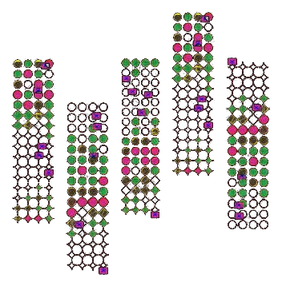
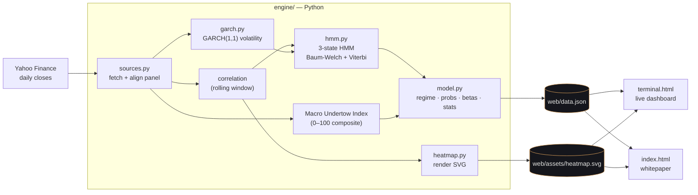
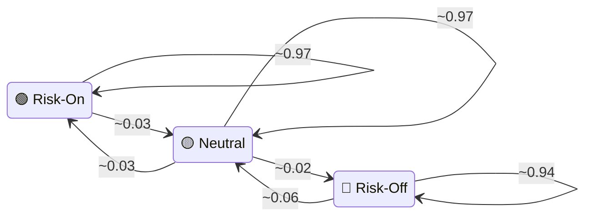
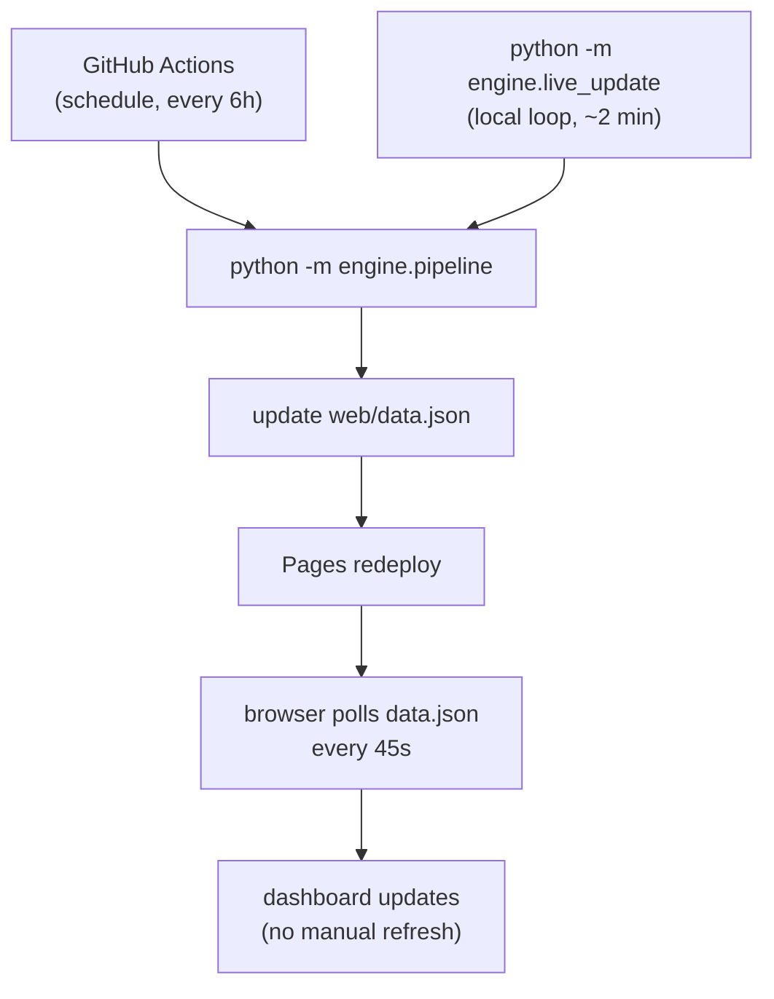

<div align="center">
  

  <h1>Undertow Research</h1>
  <p><strong>The macro layer for on-chain markets.</strong></p>

  <p>
    <a href="https://undertowmacro.xyz"></a>
    <a href="https://x.com/undertowmacro"></a>
    <a href="https://github.com/nickbauman77/Undertow-Research"></a>
    <a href="https://nickbauman77.github.io/Undertow-Research/terminal.html"></a>
  </p>
  <p>
    <a href="https://github.com/nickbauman77/Undertow-Research/actions/workflows/tests.yml"></a>
    <a href="https://github.com/nickbauman77/Undertow-Research/actions/workflows/pages.yml"></a>
    <a href="LICENSE"></a>
    
    
    
  </p>
</div>

---

> Bitcoin, U.S. & Korean equities, gold, crude oil and the spot-crypto ETFs are **not
> independent**. They breathe to the same rhythm — the expansion and contraction of global
> dollar liquidity. What traders feel as a vague *"everything is connected"* is a single
> underlying force pushing every risk asset in tandem and rotating capital between them as a
> switch flips between **risk-on** and **risk-off**.

**Undertow measures that force.** It estimates the unobserved *macro state* of the world —
a cross-asset **risk regime** and a composite **liquidity index** — from real public market
data, and is designed to publish it on-chain as a verifiable primitive any application can
consume.

## Contents

- [What it is](#what-it-is)
- [How it works](#how-it-works)
- [The model](#the-model)
- [The dashboard](#the-dashboard)
- [Repository layout](#repository-layout)
- [Quickstart](#quickstart)
- [Data contract](#data-contract)
- [Live data & refresh](#live-data--refresh)
- [Roadmap](#roadmap)
- [Disclaimers](#disclaimers)
- [Links](#links)

## What it is

Three things, decoupled by a single JSON artifact:

| Layer | What | Where |
|------|------|-------|
| **Engine** | A Python pipeline that fetches real cross-asset prices and computes the macro state with a hand-rolled **HMM** + **GARCH** model | [`engine/`](engine/) |
| **Frontend** | A research whitepaper and a live dashboard (Terminal / Regime Explorer / Oracle), dependency-free | [`web/`](web/) |
| **Protocol (vision)** | An on-chain oracle that publishes the regime/index as a verifiable primitive — *designed, not yet deployed* | whitepaper |

## How it works



The panel: **BTC, ETH, S&P 500, Nasdaq, KOSPI, gold, WTI crude, the dollar index (DXY)**
and the **10y Treasury yield**. Source: the public Yahoo Finance chart API — no key required.

## The model

The engine turns the raw panel into two headline outputs — a continuous **index** and a
discrete **regime** — plus the supporting statistics. Full detail in
[`docs/methodology.md`](docs/methodology.md).

### 1. Correlation & volatility

The trailing-window correlation matrix `R_t` captures who is moving with whom; its mean
pairwise value `ρ̄(t)` rises toward one when the market sells off as a bloc. Risk-basket
**volatility** comes from a maximum-likelihood **GARCH(1,1)**:

```
h_t = ω + α·r²_{t-1} + β·h_{t-1}        ω > 0,  α,β ≥ 0,  α + β < 1
```

### 2. Macro Undertow Index (0–100)

A composite of four standardized features — risk-basket momentum (**+**), the dollar move
(**−**), mean correlation (**−**) and realized volatility (**−**) — mapped to a percentile:

```
score = z(mom) − z(dxy) − z(ρ̄) − z(vol)
Index = 100 · percentile_rank(score)
```

High = a rising tide of liquidity & risk appetite; low = a draining one.

### 3. Risk regime — a hidden Markov model

The regime is the hidden state of a **3-state Gaussian HMM** (`engine/hmm.py`), fit by
**Baum-Welch** (EM, log-space forward-backward) and decoded with **Viterbi**. Posterior
state probabilities come from the smoother; the transition matrix `A` is estimated, not
assumed.



> *Estimated transition probabilities are sticky (strong diagonal): regimes persist for
> days-to-months, not single sessions.* The whole estimator is implemented from scratch in
> NumPy/SciPy — no `hmmlearn` / `arch` dependency — and covered by tests.

### 4. Sensitivity (β) & regime statistics

Each asset's **beta** to the index (normalized to SPX = 1) separates "moved by the tide"
from "moving on its own". Per-regime statistics report how mean correlation, volatility,
share-of-time and duration differ across Risk-On / Neutral / Risk-Off.

## The dashboard

`web/terminal.html` — the **Undertow Terminal** — has three views, all driven by
`data.json` and auto-refreshing:

| View | Shows |
|------|-------|
| **Terminal** | The index gauge, regime probabilities, liquidity drivers, the index time series, the correlation heatmap, and per-asset β. |
| **Regime Explorer** | The HMM state machine, the estimated transition matrix, a 36-week regime history, and per-regime statistics. |
| **Oracle Dashboard** | The latest report, a recent feed, protocol parameters, and the off-chain → on-chain pipeline (on-chain fields are testnet placeholders). |

👉 **Live:** <https://nickbauman77.github.io/Undertow-Research/terminal.html>

## Repository layout

```
.
├── engine/                 # Python data pipeline
│   ├── sources.py          #   fetch & align the cross-asset panel (Yahoo Finance)
│   ├── model.py            #   correlation, index, regime, betas, transitions, stats
│   ├── hmm.py              #   Gaussian HMM (Baum-Welch + Viterbi, from scratch)
│   ├── garch.py            #   GARCH(1,1) conditional volatility (MLE)
│   ├── heatmap.py          #   render the correlation matrix to SVG
│   ├── pipeline.py         #   orchestrate: fetch -> model -> write
│   └── live_update.py      #   re-run on an interval
├── web/                    # static, dependency-free frontend
│   ├── index.html          #   the whitepaper
│   ├── terminal.html       #   the live dashboard
│   ├── data.json           #   latest computed snapshot
│   └── assets/             #   logo, favicons, heatmap.svg
├── tests/                  # pytest suite (hmm, garch, model)
├── docs/                   # methodology & architecture
├── .github/                # CI (tests, data refresh, Pages deploy) + templates
├── requirements.txt
└── LICENSE
```

## Quickstart

```bash
pip install -r requirements.txt

# 1. compute a fresh snapshot (writes web/data.json + web/assets/heatmap.svg)
python -m engine.pipeline

# 2. serve the site
python -m http.server 8777 --directory web

# 3. run the tests
pytest -q
```

Open:
- <http://localhost:8777/index.html> — the whitepaper
- <http://localhost:8777/terminal.html> — the dashboard

Keep data fresh locally with `python -m engine.live_update` (re-runs every ~2 min).

## Data contract

The engine writes one JSON object; the dashboard reads it. Key fields:

| Field | Meaning |
|-------|---------|
| `as_of` | UTC date of the latest close |
| `model` | `hmm` or `threshold` (which path produced the regime) |
| `index` / `index_exact` | Macro Undertow Index, 0–100 |
| `regime` | `Risk-On` / `Neutral` / `Risk-Off` |
| `probs` | posterior state probabilities |
| `rho_bar` | mean pairwise correlation |
| `corr` | N×N conditional correlation matrix |
| `betas` | per-asset beta to the index |
| `transition` | 3×3 HMM transition matrix |
| `regime_stats` | per-regime ρ̄ / vol / share / duration |
| `drivers` | liquidity drivers (DXY, yield, momentum, vol, ρ̄) |
| `chart` | index / ρ̄ / regime time series |
| `feed` / `history` | recent per-epoch reports / 36-week regime sequence |

## Live data & refresh



- **Local:** the loop re-runs the engine every ~2 minutes.
- **CI:** [`refresh-data.yml`](.github/workflows/refresh-data.yml) recomputes and commits the
  snapshot on a schedule; Pages redeploys automatically.
- **Browser:** the dashboard polls `data.json` every 45 s.

## Roadmap

- [x] Cross-asset data pipeline (real market data)
- [x] Composite Macro Undertow Index
- [x] Hidden-Markov regime + GARCH volatility
- [x] Live dashboard (Terminal / Regime / Oracle) + whitepaper
- [x] Tests + CI + GitHub Pages deploy
- [ ] **DCC-GARCH** dynamic conditional correlation
- [ ] On-chain oracle (optimistic reporting, staking) — *Solidity*
- [ ] Intraday cadence & more assets

## Disclaimers

This is a **research project under active development**. The model describes statistical
relationships, not certainties: *correlation is not causation, and past behavior does not
guarantee future results.* The on-chain oracle is **not yet deployed**. Nothing here is
financial, investment, or legal advice, nor an offer to buy or sell any security or token.
Licensed under [MIT](LICENSE).

## Links

| | |
|---|---|
| 🌐 Website | <https://undertowmacro.xyz> |
| 𝕏 Twitter | [@undertowmacro](https://x.com/undertowmacro) |
| 📈 Live dashboard | <https://nickbauman77.github.io/Undertow-Research/terminal.html> |
| 📄 Whitepaper | <https://nickbauman77.github.io/Undertow-Research/> |
| 💻 Source | <https://github.com/nickbauman77/Undertow-Research> |
